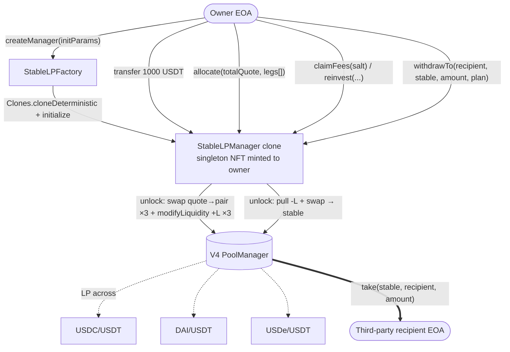
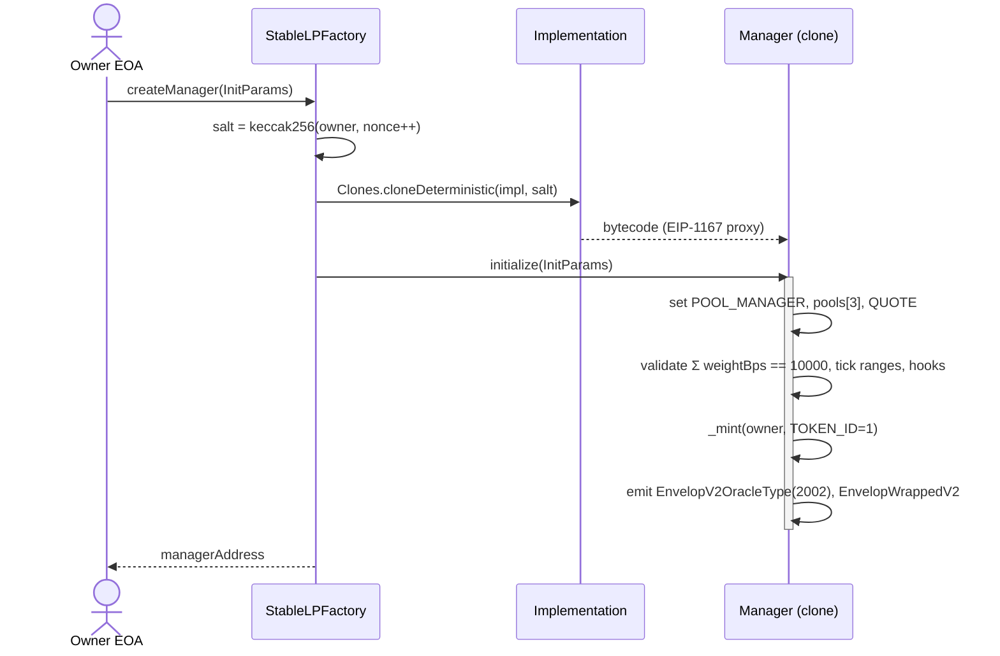
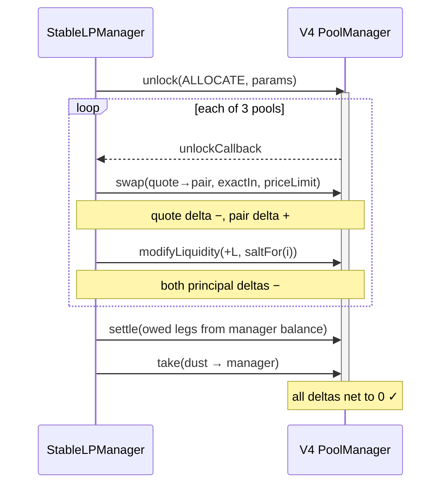
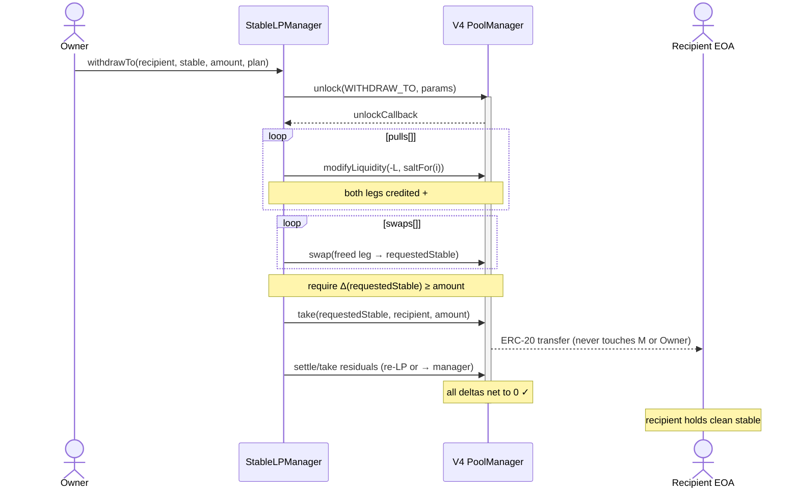
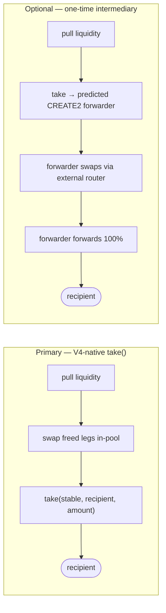

# StableLPManager — менеджер стейбл-ликвидности с непрямым выводом

> **⚠️ Историческая презентация дизайна v1.** Контракт **реализован**, но по модели **v2**
> (`task_014`+): больше нет единого `QUOTE`, трёх фиксированных пулов и весов. Текущая модель —
> динамический набор произвольных стейбл-пулов (1..`MAX_POOLS`), депозит любого управляемого стейбла,
> раскладку задаёт оператор «ногами» через `allocate` (авто) / `allocateFrom` (ручной, с гардом
> «трогаем только указанный стейбл»), плюс протокольная комиссия 10% (ERC-6909) и поддержка native
> ETH. **Диаграммы и слайды ниже показывают исходный дизайн v1 и оставлены для истории.**
> **Актуально:** полная спека `spec_StableLPManager.md` (EN) + диаграммы движений ассетов и дельт
> `StableLPManager_flows_ru.md` (RU). `withdrawTo` и инвариант непрямого вывода — без изменений.

## Концепция

**Position Manager для стейблов**, создаваемый EOA через фабрику (как в Envelop V2). Владелец заводит в менеджер один «котировочный» стейбл — например **1000 USDT** — и менеджер по настраиваемым весам **автоматически распределяет** его по трём пулам Uniswap V4: `USDC/USDT`, `DAI/USDT`, `USDe/USDT`, становясь LP-провайдером во всех трёх за одну транзакцию. Поскольку каждому пулу нужны *оба* токена, менеджер внутри той же V4-операции свапает часть USDT в парный стейбл, после чего добавляет ликвидность.

Владелец периодически **собирает комиссии** (с опциональным **реинвестом**), а главная фича — **непрямой вывод**: заявка на любой объём любого из стейблов пула (`USDT` / `USDC` / `DAI` / `USDe`) с доставкой на **произвольный сторонний EOA**, при жёстком условии:

> **Заказанный стейбл в процессе вывода не должен попадать на ERC-20 баланс ни менеджера, ни владельца.**

Это обеспечивается нативно средствами Uniswap V4: внутри одного колбэка `PoolManager.unlock` менеджер вынимает ликвидность, при необходимости свапает освобождённые «ноги» в нужный стейбл и вызывает `take(стейбл, получатель, сумма)` — токены уходят **напрямую от PoolManager к получателю**. Стейбл существует только как временная *дельта* в учёте PoolManager и никогда не становится балансом, которым владеет менеджер или владелец.

## Жизненный цикл



## Фабрика и создание

Менеджеры создаются как **минимальные прокси-клоны (EIP-1167) через CREATE2** по образцу фабрик Envelop V2. Адрес будущего менеджера предсказуем заранее.

Так как клон **не запускает конструктор реализации**, адрес `POOL_MANAGER` и конфигурация трёх пулов не могут быть `immutable` — они задаются в одноразовом методе `initialize(...)`, защищённом флагом инициализации. Там же владельцу минтится синглтон-NFT (`TOKEN_ID = 1`), который и есть единственный корень прав на менеджер. Для совместимости с индексаторами Envelop при инициализации эмитятся события `EnvelopV2OracleType(2002, ...)` и `EnvelopWrappedV2(...)`.



## Модель авторизации

Кто держит NFT — тот управляет менеджером. Две роли:

- **Владелец NFT** (`onlyOwnerNFT`) — единственный, кто может выводить капитал наружу.
- **Оператор** (`onlyAuthorized` = владелец или оператор) — бот, которому делегированы операции, не уводящие средства из менеджера. При передаче NFT список операторов автоматически очищается.

| Функция | Кто может вызвать | Почему |
|---------|------------------|--------|
| `allocate` | владелец / оператор | средства остаются в позициях менеджера |
| `claimFees` | владелец / оператор | комиссии возвращаются в менеджер |
| `reinvest` | владелец / оператор | компаундинг в позиции менеджера |
| `decreasePosition` / `pokePosition` | владелец / оператор | средства возвращаются в менеджер |
| **`withdrawTo`** | **только владелец NFT** | **отправка средств на произвольный EOA — это primitive для слива** |
| настройки (операторы, хуки, конфиг пулов) | только владелец NFT | изменение политики/конфигурации |

**Ключевая асимметрия:** единственная функция, отправляющая средства на произвольный внешний адрес, — `withdrawTo`, и поэтому она доступна только владельцу NFT. Операторам достаются только «входящие» операции. Так сохраняется инвариант: операторы управляют позициями, но капитал наружу двигает только владелец.

## Конфигурация пулов

Задаётся при инициализации, меняется только владельцем. Для каждого из трёх пулов хранится: ключ пула, какая из сторон пары является котировочным стейблом (USDT), диапазон тиков, вес доли (в bps, сумма по трём пулам = 10000) и сид соли для позиции. Набор выводимых стейблов = котировочный USDT плюс «парные» стороны трёх пулов (USDC, DAI, USDe).

**Диапазон тиков.** Узкий диапазон вокруг паритета 1:1 (≈ ±0.5–1%) даёт максимальную капиталоэффективность для жёстко привязанных пар. Для `USDe` (мягкая привязка) диапазон стоит расширить. Полный диапазон — безопасный вариант «без обслуживания».

## Авто-split депозита — `allocate`

Владелец переводит USDT на адрес менеджера обычным ERC-20-трансфером (хук-получатель не нужен), затем вызывает `allocate`. Разбивку по пулам и оптимальный размер свапа считает **off-chain** оператор; контракт **проверяет** их on-chain.

Внутри одного `unlock` для каждого пула: читается текущая цена, часть USDT свапается в парный стейбл, по полученным двум суммам вычисляется ликвидность `L` (через `PositionMath`), вызывается `modifyLiquidity(+L)`, позиция записывается/доращивается в реестре. В конце по каждому из четырёх стейблов остаточные дельты «закрываются»: отрицательные — `settle` из баланса менеджера, положительная пыль от округления — `take` обратно в менеджер (никогда не `clear`, иначе пыль сгорает).



**Почему всё сходится (delta-netting).** Источники дельт — только свапы (`−вход / +выход`) и добавления ликвидности (`−принципал0 / −принципал1`). Каждую отрицательную дельту мы `settle`-им из баланса менеджера, каждую положительную пыль `take`-аем в менеджер. Сумма всех `settle` и `take` равна сумме всех дельт ⇒ по каждому стейблу выходит ноль ⇒ ревёрта `CurrencyNotSettled` нет.

**Размер свапа.** «Свапнуть половину» — неточно: формула ликвидности упирается в более дефицитную сторону. Оператор off-chain решает оптимальную пропорцию под выбранный диапазон и передаёт её; контракт валидирует через минимальную ликвидность и максимумы по суммам. Остаток-пыль возвращается в менеджер и идёт в следующий `allocate`.

## Непрямой вывод — `withdrawTo`

Главная фича, доступна **только владельцу NFT**. Владелец указывает получателя, нужный стейбл, точную сумму и **план**, посчитанный оператором off-chain: из каких позиций вынимать ликвидность и какими свапами превратить освобождённые «ноги» в нужный стейбл. Контракт проверяет план и выполняет его в одном `unlock`, после чего делает `take` напрямую получателю.

Внутри колбэка: (1) для каждого шага плана `modifyLiquidity(-L)` — обе «ноги» (принципал + накопленные комиссии) зачисляются положительными дельтами; (2) свапы превращают освобождённые «ноги» в нужный стейбл; (3) проверяется, что положительная дельта по нужному стейблу ≥ суммы заявки; (4) `take(стейбл, получатель, сумма)` — ERC-20 уходит от PoolManager сразу получателю, минуя балансы менеджера и владельца; (5) остатки либо реинвестируются обратно в ликвидность, либо `take`-аются в менеджер.



**Кто выбирает маршрут.** Контракт не выбирает позиции и не строит маршрут сам. Off-chain агент читает состояние позиций и пулов, формирует план и передаёт его; контракт лишь проверяет инварианты (лимиты по позициям и ликвидности, ценовые лимиты свапов, фактически доставленную сумму, ненулевого получателя). **Быстрый путь:** если запрошен сам USDT и в позиции его достаточно, свапов нет — только вынуть и `take`.

### Основной механизм vs. опциональная прослойка



| | V4-native `take()` (основной) | Одноразовая прослойка (опция) |
|--|-------------------------------|-------------------------------|
| Атомарность | одна транзакция, один `unlock` | две фазы (`unlock` → вызов форвардера) |
| Касание балансов менеджера/владельца | **никогда** | никогда (берётся сразу на форвардер) |
| Маршрут | внутри трёх пулов V4 | любой внешний роутер / другой протокол |
| Стоимость / сложность | низкая | выше (CREATE2-деплой на каждый вывод) |
| Когда применять | стейбл достижим через три пула | **токена нет ни в одном пуле** или лучший маршрут вне V4 |

## Сбор комиссий и реинвест

- **`claimFees`** — лёгкая обёртка над «poke»: `modifyLiquidity(0)` высвобождает накопленные комиссии, которые `take`-аются в менеджер. Доступно оператору (комиссии идут в менеджер, а не на сторонний EOA).
- **`reinvest`** — реализует комиссии через `modifyLiquidity(0)`, при необходимости свапает их в нужную пропорцию и доливает обратно в ликвидность. Тот же принцип netting, что и у `allocate`, но источник средств — дельты комиссий.

> Накопленные комиссии (`feesAccrued`) **нельзя** использовать для учёта/выплат: в пуле с единственным LP их можно «надуть» донатом самому себе. Используется только реально реализованная дельта.

## Одноразовая прослойка (опция / фаза 2)

Для маршрутов, выходящих за пределы трёх пулов (нужного токена нет ни в одном пуле, либо лучший маршрут — через внешний роутер), менеджер `take`-ает освобождённые «ноги» **сразу на одноразовый форвардер**, а не себе.

Это минимальный контракт без админа, с зашитыми при создании параметрами (входной токен, роутер, получатель, минимальный выход). Единственный метод выполняет свап через роутер, отправляет 100% результата получателю и требует нулевого остатка на себе. Менеджер деплоит его через CREATE2 с солью на каждый вывод (адрес предсказуем), переводит средства на этот предсказанный адрес и затем вызывает исполнение. Детерминированный адрес и одноразовая соль исключают повторное использование. **Помечено как опциональное** — нативного `take` достаточно для всего заявленного продукта на USDT/USDC/DAI/USDe.

## Архитектурные решения

| Тема | Решение | Обоснование |
|------|---------|-------------|
| Деплой | Клон (EIP-1167 + CREATE2) через фабрику | дёшево на экземпляр, предсказуемый адрес, как в Envelop V2 |
| Инициализация | одноразовый `initialize(...)` | клоны не запускают конструктор |
| Распределение | **авто-split** по настраиваемым весам | один депозит, одна транзакция |
| Размер свапа | off-chain, проверка on-chain | гибкость + дешёвый газ |
| Механизм вывода | **V4-native `take()` основной**, прослойка опционально | нативный путь атомарен, дёшев, не трогает балансы |
| План вывода | задаёт оператор, контракт проверяет инварианты | гибкий маршрут, контракт стережёт только инварианты |
| Права на вывод | только владелец NFT | произвольный получатель `take` = primitive слива |
| Диапазон тиков | узкий ±0.5–1% (шире для USDe), полный — запасной | капиталоэффективность для привязанных пар |
| Учёт комиссий | только реализованная дельта | защита от «надувания» feesAccrued |

## Риски

| Риск | Критичность | Меры |
|------|-------------|------|
| Оператор сливает средства через `withdrawTo` | 🔴 Критично | `withdrawTo` только для владельца NFT; у операторов нет «исходящих» операций |
| Проскальзывание / сэндвич на свапах | 🔴 Высоко | обязательные ценовые лимиты + off-chain минимумы; опционально дедлайн |
| Ревёрт `CurrencyNotSettled` из-за неполного netting | 🟡 Средне | закрывать все четыре стейбла в конце колбэка; покрыто тестами |
| Вредоносный хук в настроенном пуле | 🔴 Высоко | проверка разрешённости хука при init и в каждой операции; предпочтительны пулы без хуков |
| «Надувание» feesAccrued | 🟡 Средне | использовать только реализованную дельту |
| Повторная инициализация клона | 🔴 Высоко | одноразовый флаг; минт синглтона реальному владельцу |
| Потеря пыли | 🟢 Низко | `take` пыли в менеджер, никогда `clear` |
| Нулевой получатель / неуправляемый стейбл | 🟢 Низко | проверки на входе |
| Недопоставка из-за кривого плана | 🟡 Средне | проверка фактически доставленной суммы до `take` |
| Потеря NFT = потеря доступа к менеджеру | 🔴 Высоко | стандартные практики хранения NFT |
```
