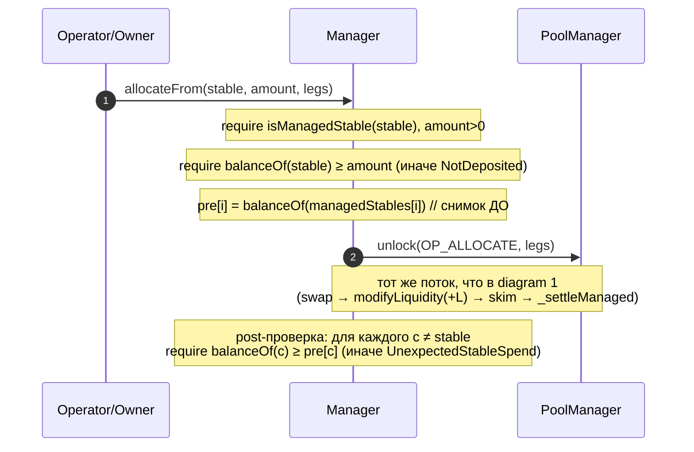
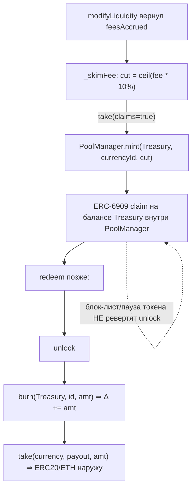

# StableLPManager — движение ассетов и дельт по операциям

Подробные mermaid-диаграммы того, **как двигаются ассеты и как меняются V4-дельты** в каждой операции
`StableLPManager`. Дополняет `spec_StableLPManager.md`. Соответствует коду на master (`be22a2c`).

## Нотация

- **`Δ(c)`** — транзиентная `currencyDelta` менеджера по валюте `c` внутри `unlock` (flash-accounting
  PoolManager). Знак:
  - `Δ(c) < 0` — менеджер **должен** пулу `|Δ|` (долг) → закрывается через `settle` (платёж с баланса);
  - `Δ(c) > 0` — пул **должен** менеджеру `Δ` (кредит) → забирается через `take` (на баланс или claim).
  - К концу `unlock` **все `Δ` обязаны быть 0**, иначе `CurrencyNotSettled` (реверт).
- **`p0/p1`** — принципал (стоимость добавляемой/выводимой ликвидности `L`) по сторонам пула.
- **`f0/f1`** — `feesAccrued` (начисленная комиссия позиции, реализуется на каждом `modifyLiquidity`).
- **Протокольный ским** = `ceil(f * 10%)` через `take(claims=true)` → **mint ERC-6909** казне (не ERC20).
- Ассеты: сплошная стрелка — реальный перевод ERC20/ETH; «(claim)» — внутренний баланс ERC-6909.

---

## 1. `allocate(legs)` — авто-аллокация (одна нога со свопом)

```mermaid
sequenceDiagram
    autonumber
    participant Op as Operator/Owner
    participant M as Manager
    participant PM as PoolManager
    participant T as Treasury

    Op->>M: allocate(legs)
    M->>PM: unlock(OP_ALLOCATE, legs)
    activate PM
    PM->>M: unlockCallback
    Note over M,PM: старт: Δ(c0)=0, Δ(c1)=0

    rect rgb(238,246,255)
    Note over M,PM: leg: опц. pre-swap (exactIn swapAmountIn)
    M->>PM: swap(zeroForOne, -swapAmountIn, swapPriceLimit)
    Note over M,PM: Δ(in) −= swapAmountIn ; Δ(out) += amountOut
    end

    rect rgb(238,255,238)
    Note over M,PM: add: L = liquidityFromAmounts(sqrtP, ticks, a0Des, a1Des)
    M->>PM: modifyLiquidity(+L)
    Note over M,PM: Δ(c0) += (−p0 + f0) ; Δ(c1) += (−p1 + f1)
    end

    rect rgb(255,244,238)
    Note over M,PM: протокольный ским 10% от f0/f1
    M->>PM: take(c0, Treasury, ceil(0.1*f0), claims=true)
    M->>PM: take(c1, Treasury, ceil(0.1*f1), claims=true)
    PM-->>T: mint ERC-6909 (claim) на 0.1*f0, 0.1*f1
    Note over M,PM: Δ(ci) −= 0.1*fi  ⇒ остаётся −pi + 0.9*fi
    end

    rect rgb(245,245,245)
    Note over M,PM: _settleManaged: нетим каждую managed-валюту
    M->>PM: settle{value?}(c) для Δ(c) < 0 (платим с баланса)
    M->>PM: take(c, Manager) для Δ(c) > 0 (остаток себе)
    Note over M,PM: к концу: все Δ = 0
    end
    deactivate PM
```

**Куда что делось.** Свежая позиция: `f=0`, ским 0, менеджер платит полный принципал `p0/p1` с баланса.
Долив существующей позиции: 10% от `f0/f1` уходит казне как ERC-6909, **оставшиеся 90% не докладываются
в позицию** — они нетятся в `_settleManaged`, уменьшая то, что менеджер доплачивает за `L` (или
забираются ему на баланс). Принципал не облагается. Позиция получает ровно операторский `L`.

---

## 2. `allocateFrom(stable, amount, legs)` — ручная (тот же поток + гард)



**Смысл гарда.** Разворачивается только что внесённый `stable`. Снимок балансов всех `managedStables`
до и после: просесть может **только** `stable`; если любой другой управляемый стейбл уменьшился — реверт
`UnexpectedStableSpend`. Так deposit-and-allocate не залезает в прежние позиции/остатки.

---

## 3. `withdrawTo(p)` — непрямой вывод (owner-only)

```mermaid
sequenceDiagram
    autonumber
    participant Ow as Owner
    participant M as Manager
    participant PM as PoolManager
    participant T as Treasury
    participant R as Recipient

    Ow->>M: withdrawTo(recipient, requestedCurrency, amount, pulls, swaps)
    Note over M: require managed(requestedStable), amount>0,<br/>каждый pull: liquidityToPull ≤ позиция
    M->>PM: unlock(OP_WITHDRAW_TO, p)
    activate PM
    PM->>M: unlockCallback

    rect rgb(238,255,238)
    Note over M,PM: 1) тянем ликвидность (по каждому pull)
    M->>PM: modifyLiquidity(-L)
    Note over M,PM: Δ(c0) += (p0 + f0) ; Δ(c1) += (p1 + f1)
    M->>PM: take(ci, Treasury, ceil(0.1*fi), claims=true)
    PM-->>T: mint ERC-6909 (claim)
    Note over M,PM: ским fee-компоненты; принципал не тронут
    end

    rect rgb(238,246,255)
    Note over M,PM: 2) конвертируем освобождённое в requestedStable
    M->>PM: swap(...) по каждому swaps[i]
    Note over M,PM: Δ сдвигается между валютами
    end

    rect rgb(255,244,238)
    Note over M,PM: 3) гард доставки
    Note over M,PM: require Δ(requestedStable) ≥ amount<br/>(иначе AmountNotDelivered)
    M->>PM: take(requestedStable, Recipient, amount)
    PM-->>R: перевод amount  (мимо баланса менеджера!)
    end

    rect rgb(245,245,245)
    Note over M,PM: 4) остатки — менеджеру
    M->>PM: _settleManaged (settle долги / take остатки себе)
    end
    deactivate PM
```

**Инвариант.** `amount` запрошенного стейбла уходит получателю **напрямую из PoolManager**
(`take(requestedStable, recipient, amount)`) — он никогда не оседает на ERC20/native-балансе менеджера
или владельца. Остальное (другой принципал + 90% fee) нетится менеджеру в `_settleManaged`. Протокольная
комиссия снимается только с **fee-компоненты** вытянутой ликвидности.

---

## 4. `reinvest(leg)` — компаундинг

```mermaid
sequenceDiagram
    autonumber
    participant Op as Operator/Owner
    participant M as Manager
    participant PM as PoolManager
    participant T as Treasury

    Op->>M: reinvest(leg)
    M->>PM: unlock(OP_REINVEST, leg)
    activate PM
    PM->>M: unlockCallback

    rect rgb(238,255,238)
    Note over M,PM: realize fees (без смены принципала)
    M->>PM: modifyLiquidity(0)
    Note over M,PM: Δ(c0) += f0 ; Δ(c1) += f1
    M->>PM: take(ci, Treasury, ceil(0.1*fi), claims=true)
    PM-->>T: mint ERC-6909 (claim)
    Note over M,PM: остаётся Δ(ci) = 0.9*fi
    end

    rect rgb(238,246,255)
    Note over M,PM: опц. pre-swap, затем доклад в позицию
    M->>PM: swap(...) (если swapAmountIn>0)
    M->>PM: modifyLiquidity(+L) где L сайзится из текущих Δ(c0),Δ(c1)
    Note over M,PM: 90% fee КОМПАУНДИТСЯ в позицию (Δ уходит в принципал)
    end

    M->>PM: _settleManaged (доводим Δ до 0)
    deactivate PM
```

**Отличие от `allocate`/`claimFees`.** Здесь оставшиеся 90% комиссии **явно докладываются в LP**:
после realize+ским остаток `0.9*fi` живёт как положительная `Δ`, из которой `_addLiquidity` сайзит
дополнительную `L`. То есть это единственная операция, где остаток реинвестируется, а не оседает на
балансе.

---

## 5. `claimFees(salt)` — харвест (poke)

```mermaid
sequenceDiagram
    autonumber
    participant Op as Operator/Owner
    participant M as Manager
    participant PM as PoolManager
    participant T as Treasury

    Op->>M: claimFees(salt)
    M->>PM: unlock(POKE, salt)
    activate PM
    PM->>M: unlockCallback
    M->>PM: modifyLiquidity(0)
    Note over M,PM: Δ(c0) += f0 ; Δ(c1) += f1  (только fees, принципал без изменений)
    M->>PM: take(ci, Treasury, ceil(0.1*fi), claims=true)
    PM-->>T: mint ERC-6909 (claim)
    M->>PM: _settleCurrency(c0), _settleCurrency(c1)
    PM-->>M: take 0.9*fi на баланс менеджера
    Note over M,PM: к концу Δ = 0
    deactivate PM
```

**Куда делось.** 10% комиссии — казне (ERC-6909), **90% — на ERC20/native-баланс менеджера** (через
`take(ci, Manager)`). Принципал не двигается.

---

## 6. Жизненный цикл протокольной комиссии (ERC-6909)

Почему ским — ERC-6909, а не ERC20-перевод, и как казна потом обналичивает:



**Зачем claims.** ERC20-перевод казне внутри `unlock` мог бы заревертить (USDC/USDT blocklist/pause), а
ским сидит на **единственном пути вывода** (`withdrawTo` → `_pullLiquidity`) и на allocate/reinvest/claim
— реверт запер бы принципал LP навсегда. Mint ERC-6909 — внутренний баланс PoolManager, его заблокировать
нельзя. Цена: казна должна уметь редимить (`unlock → burn → take`), т.е. быть контрактом-redeemer или
делегировать ему (EOA сам не сможет — может лишь `transfer` claim'ы такому контракту).

---

> Сверка: все названия структур/функций/полей соответствуют `src/StableLPManager.sol` @ `be22a2c`
> (`AllocLeg` уже без `amount*Max`, `salt == poolId`, immutable `PROTOCOL_TREASURY`, ERC-6909 ским).
