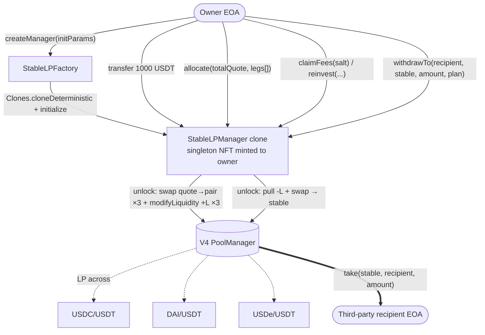
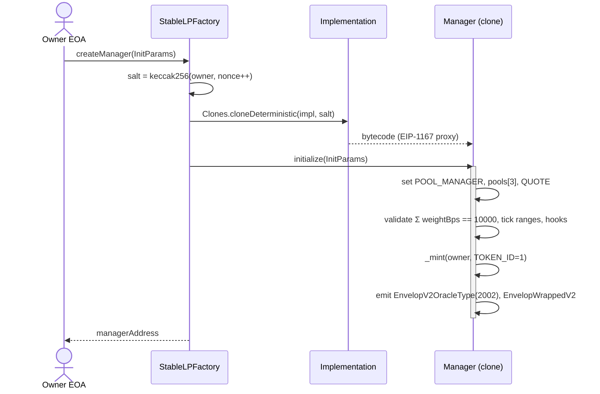
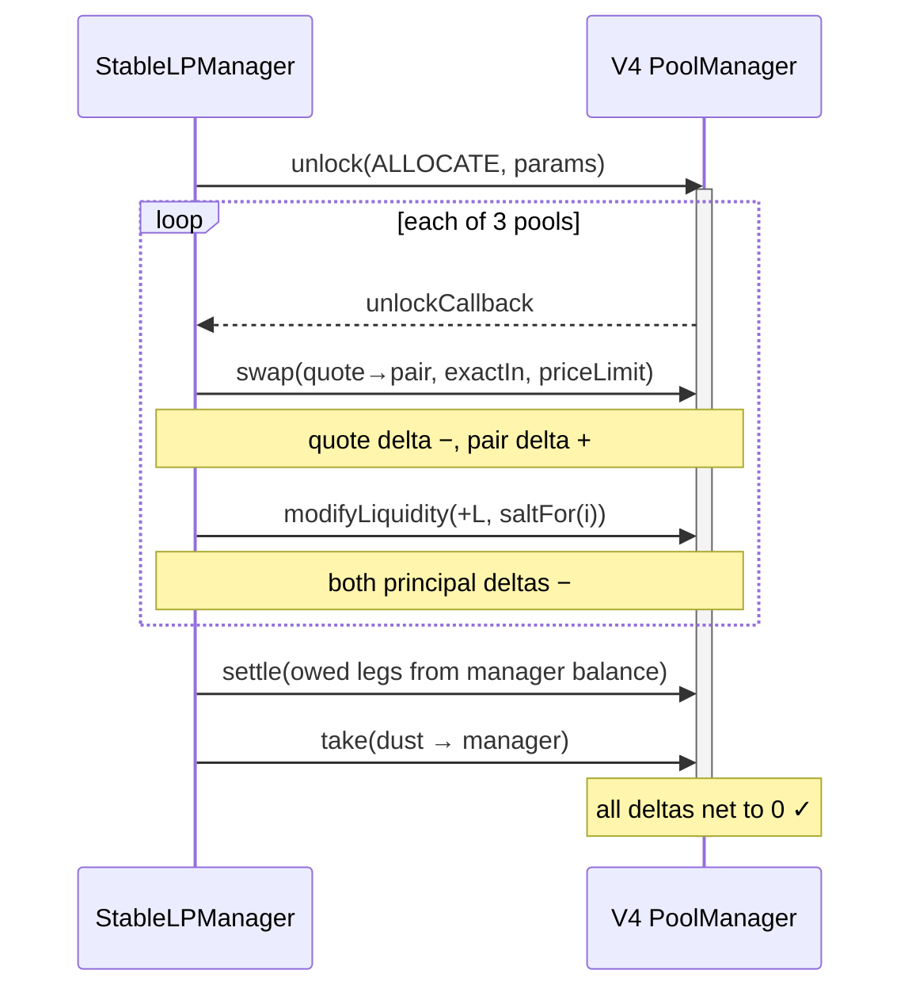
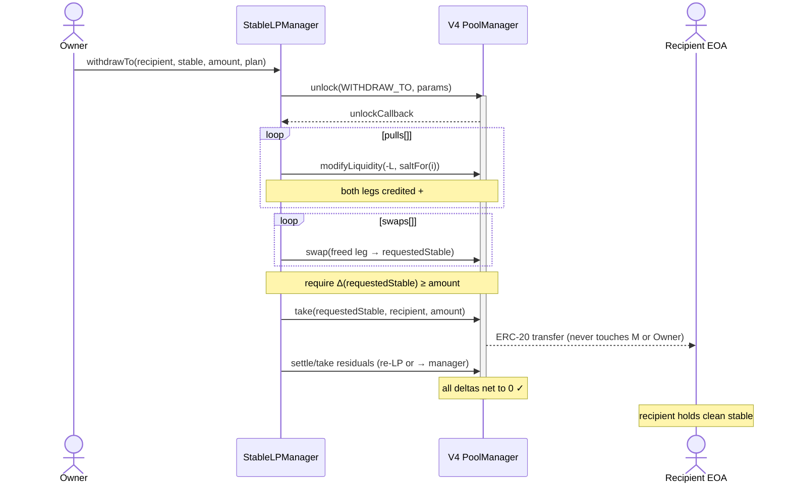
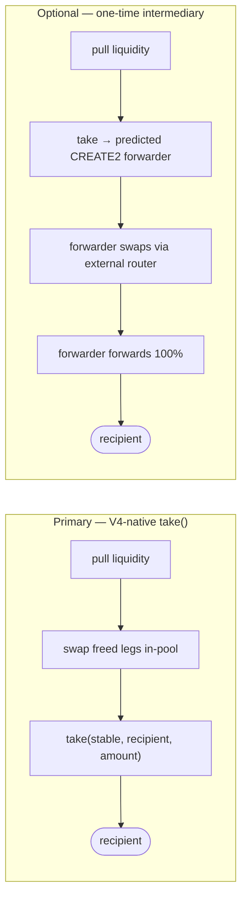

# StableLPManager — Multi-Pool Stable LP Manager with Indirect Withdraw

> **⚠️ Superseded in part by v2 (`task_014_stable_lp_v2.md`).** The implemented contract drops the
> single-`QUOTE` / three-fixed-pools / weight-split model described below. Current model: a
> **dynamic set of arbitrary stable pools** (1..`MAX_POOLS`, no common hub required); **any** managed
> stable can be deposited; liquidity is deployed by **operator-supplied legs** (each leg = pool +
> optional pre-swap + desired add amounts + slippage caps) via `allocate` (auto: deploy whatever sits
> on balance) or `allocateFrom(stable, amount, legs)` (manual: deploy a named just-deposited stable,
> guarded so only that stable is drawn down). `withdrawTo` and the indirect-withdraw invariant are
> unchanged. A **protocol fee** (constant 10%, see `task_015_protocol_fee.md`) is skimmed to an
> immutable treasury on every realized fee accrual (claim/reinvest/withdraw/top-up). Sections below
> describing QUOTE/weights/3 fixed pools are historical.
>
> **Status:** Architecture draft. Not implemented.
> **Sibling spec:** `spec_JITLPWallet.md` — single-pool, owner-directed *tactical* LP wallet where the caller passes explicit amounts and one `PoolKey` per `openPosition`. This spec describes a different product: a factory-spawned manager that **auto-splits a single stable deposit across three V4 pools** and supports **indirect withdraw** — delivering any managed stable to an arbitrary third-party EOA without the funds ever touching the manager's or owner's balance.
> **Base it forks:** `src/UniSmartWallet.sol` (auth, `unlock`/`unlockCallback` dispatcher + `Op` enum, salt registry, hook policy, `PositionMath`).

## Concept

A **factory-deployed, NFT-owned position manager** for **stable-pair liquidity**. An EOA mints an instance from a clone factory, deposits one quote stable (e.g. **1000 USDT**), and the manager **auto-splits** it by configurable weights across **three V4 pools** — `USDC/USDT`, `DAI/USDT`, `USDe/USDT` — becoming an LP in all three in a single transaction. Because each pool needs *both* of its tokens, the manager swaps part of each pool's USDT allocation into the paired stable inside the same V4 `unlock`, then adds liquidity.

The owner periodically **claims fees** (optionally **reinvesting** them), and — the headline feature — issues an **indirect withdraw**: a request for any amount of any managed stable (`USDT` / `USDC` / `DAI` / `USDe`), delivered to an **arbitrary recipient EOA**, under a hard constraint:

> **The requested stable must never land on the ERC-20 balance of the manager or the owner during the withdraw.**

This is satisfied natively by Uniswap V4: inside one `PoolManager.unlock` callback the manager pulls liquidity, optionally swaps the freed legs into the requested stable, and calls `take(requestedStable, recipient, amount)` — which transfers ERC-20 **straight from PoolManager to the recipient**. The stable exists only as a transient PoolManager *delta*, never as a token balance the manager or owner holds.

**Key contrasts:**

| | UniSmartWallet (sibling) | StableLPManager (this) |
|--|--------------------------|------------------------|
| Creation | One contract per `new` deploy | Clone via factory (EIP-1167 + CREATE2) |
| Capital model | Owner passes explicit amounts per pool | **Auto-split** one quote stable across 3 pools |
| Swap-on-deposit | None (caller pre-funds both legs) | Manager swaps quote→pair inside unlock |
| Pools | Arbitrary, one per `openPosition` | Three fixed stable pools, configured at init |
| Withdraw | `executeEncodedTx` → owner's chosen address (touches balances) | **Indirect** — PoolManager → arbitrary EOA, balances untouched |
| Audience | Power users / MEV operators | Stable LPs wanting private/clean payouts |

## Lifecycle



## Factory & creation

Modeled on `lib/envelop-protocol-v2/src/EnvelopWNFTFactory.sol` / `MyShchFactory.sol`: the factory holds an implementation address and spawns **EIP-1167 minimal-proxy clones** via `Clones.cloneDeterministic(impl, salt)`, forwarding an ABI-encoded `initialize(...)` call. CREATE2 makes the manager address predictable (`predictDeterministicAddress`).

**Why `initialize` instead of a constructor:** clones do not run the implementation's constructor, so `POOL_MANAGER` and the 3-pool config cannot be `immutable` (unlike `UniSmartWallet`, which is deployed directly). They move into a one-shot `initialize(InitParams)` guarded by an `_initialized` flag. The singleton NFT (`TOKEN_ID = 1`) is minted to the **real owner** (not the factory) inside `initialize`. Envelop oracle compatibility events (`EnvelopV2OracleType(ORACLE_TYPE = 2002, ...)` and `EnvelopWrappedV2(...)`) are emitted from `initialize` so existing Envelop indexers pick the contract up — same contract as `UniSmartWallet`.



## Authorization model

Reuses `UniSmartWallet`'s singleton-NFT auth verbatim: `onlyOwnerNFT` (NFT holder only) and `onlyAuthorized` (owner **or** operator), with the operator list auto-cleared on NFT transfer via the ERC-721 `_update` hook.

| Function | Modifier | Why |
|----------|----------|-----|
| `allocate` | `onlyAuthorized` | Value stays in the manager's positions — operator-safe |
| `claimFees` | `onlyAuthorized` | Fees route back to the manager — operator-safe |
| `reinvest` | `onlyAuthorized` | Compounds into manager positions — operator-safe |
| `decreasePosition` / `pokePosition` | `onlyAuthorized` | Inherited; value returns to manager |
| **`withdrawTo`** | **`onlyOwnerNFT`** | **Sends funds to a caller-chosen EOA — an operator with this power is a drain** |
| `setOperator` / `setHookAllowed` / `setHookRegistry` / `setPoolConfig` | `onlyOwnerNFT` | Policy/config changes |
| `executeEncodedTx` / `executeEncodedTxBatch` | `onlyOwnerNFT` | Inherited arbitrary call |

**Critical asymmetry:** `withdrawTo` (and the optional intermediary path) is the *only* primitive that moves value to an arbitrary external address, so it must be `onlyOwnerNFT`. Operators get exactly the inward-routing primitives. This preserves the same invariant `UniSmartWallet` enforces — operators manage positions, only the owner moves capital out.

## Pool configuration

Set at `initialize`, mutable only by the owner via `setPoolConfig`:

```solidity
struct PoolConfig {
    PoolKey key;        // one of the 3 stable pools
    Currency quoteSide; // which side of the pair is the QUOTE stable (USDT)
    int24 tickLower;    // chosen band
    int24 tickUpper;
    uint16 weightBps;   // split weight; Σ across the 3 pools == 10_000
    bytes32 baseSalt;   // deterministic salt seed for this pool's position
}

PoolConfig[3] public pools;             // [USDC/USDT, DAI/USDT, USDe/USDT]
Currency public QUOTE;                   // USDT (the deposited quote)
mapping(Currency => bool) public isManagedStable; // QUOTE + the 3 pair tokens
```

The set of withdrawable stables = `QUOTE` plus the non-quote side of each pool (`USDC`, `DAI`, `USDe`). Each pool's position uses a deterministic salt `keccak256(abi.encode(pools[i].baseSalt, i))`, so the three auto-split positions are discoverable.

**Tick band.** A **narrow band around 1:1** (≈ ±0.5–1%, snapped to `tickSpacing` via `PositionMath`) maximizes capital efficiency for tightly-pegged pairs. `USDe` (soft peg) should use a wider band. **Full range** is the zero-maintenance fallback. The band is validated with `PositionMath.requireValidTickRange` at init.

## Auto-split deposit — `allocate`

The owner transfers the quote stable to the manager (plain ERC-20 transfer — no receiver hook needed, exactly like `UniSmartWallet`), then calls `allocate`. The operator computes the per-pool split and the optimal swap size **off-chain**; the contract **validates** it on-chain (mirroring how `UniSmartWallet` makes the operator pass a full `PoolKey` rather than discovering pools itself).

```solidity
struct AllocLeg {
    uint8   poolIndex;        // 0..2
    uint256 quoteIn;          // USDT assigned to this pool (Σ == totalQuote)
    uint256 swapQuoteToPair;  // USDT to swap into the pair token (exactIn)
    uint160 swapPriceLimit;   // sqrtPriceLimitX96 — slippage guard on the swap
    uint128 minLiquidity;     // floor on minted L (slippage on the add)
    uint128 amount0Max;       // settle caps (mirror UniSmartWallet OpenParams)
    uint128 amount1Max;
}
struct AllocateParams { uint256 totalQuote; AllocLeg[] legs; }

function allocate(AllocateParams calldata p) external onlyAuthorized nonReentrant;
```

**Pre-checks (outside unlock):** `totalQuote != 0`; `Σ legs.quoteIn == totalQuote`; each `poolIndex < 3`; each pool initialized (`getSlot0 != 0`) and its hook allowed; manager's USDT balance ≥ `totalQuote`.

**Unlock handler `_handleAllocate`, per leg `i` (pool `P = pools[poolIndex]`):**

1. Read `sqrtP = getSlot0(P.key.toId())`.
2. **Swap** `swapQuoteToPair` USDT → pair token via `POOL_MANAGER.swap(P.key, SwapParams{zeroForOne: QUOTE==currency0, amountSpecified: -int256(swapQuoteToPair), sqrtPriceLimitX96: swapPriceLimit}, "")`. Quote-side delta goes negative (owed), pair-side delta goes positive (credit).
3. Compute LP amounts: `amountQuoteForLP = quoteIn - swapQuoteToPair`, `amountPairForLP = swapOut`; order into `(amount0, amount1)` by currency sort.
4. `L = PositionMath.liquidityFromAmounts(sqrtP, P.tickLower, P.tickUpper, amount0, amount1)`; require `L >= minLiquidity`.
5. **`modifyLiquidity(+L)`** with `salt = saltFor(i)`; both principal deltas go negative (owed); enforce `owed0 <= amount0Max`, `owed1 <= amount1Max`.
6. Record/merge `positions[saltFor(i)]` (new → push to registry like `_handleOpen`; existing → `liquidity += L`).

**Settle/take across the 4-currency set** after the loop: for each touched currency, a remaining **negative** delta → `settle(...)` from the manager's balance; a remaining **positive** dust delta (rounding in `getLiquidityForAmounts`) → `take(..., address(this), dust)` back to the manager. Never `clear` (it burns the dust).



**Delta-netting argument.** The only delta sources are swaps (`−in / +out`) and adds (`−prin0 / −prin1`). Every net-negative leg is `settle`d from the manager's balance; every net-positive dust leg is `take`n to the manager. Σ(settles) + Σ(takes) = Σ(all deltas) ⇒ every currency nets to zero ⇒ no `CurrencyNotSettled` revert.

**Swap sizing.** "Swap half" is wrong at the margin — `getLiquidityForAmounts` binds on the scarcer side. The operator solves the optimal single-sided-deposit ratio for the chosen band off-chain and passes `swapQuoteToPair`; the contract validates via `minLiquidity` + `amountXMax`. Leftover dust (a few wei) is taken back to the manager and rolls into the next `allocate`.

## Indirect withdraw — `withdrawTo`

The headline feature, **`onlyOwnerNFT`**. The owner specifies the recipient, the requested stable, the exact amount, and an **operator-computed plan** of which positions to unwind and which swaps convert the freed legs into the requested stable. The contract validates and executes the plan in one unlock, then `take`s straight to the recipient.

```solidity
struct WithdrawStep { uint8 poolIndex; uint128 liquidityToPull; }    // modifyLiquidity(-L)
struct WithdrawSwap {
    uint8   poolIndex;
    bool    zeroForOne;
    int256  amountSpecified;     // convert a freed leg into requestedStable (exactOut preferred)
    uint160 sqrtPriceLimitX96;   // per-swap slippage guard
}
struct WithdrawToParams {
    address  recipient;
    Currency requestedStable;
    uint256  amount;             // exact amount delivered to recipient
    WithdrawStep[] pulls;
    WithdrawSwap[] swaps;
    bool     reinvestRemainder;  // true → re-LP leftovers; false → take-to-self (manager)
}

function withdrawTo(WithdrawToParams calldata p) external onlyOwnerNFT nonReentrant;
```

**Pre-checks:** `recipient != address(0)` (`RecipientZero`); `isManagedStable[requestedStable]` (`UnmanagedStable`); `amount != 0`; each `pull.poolIndex < 3` and `pull.liquidityToPull <= positions[saltFor(i)].liquidity`; each swap's pool initialized and hook allowed.

**Unlock handler `_handleWithdrawTo`:**

1. **Pull** — for each `WithdrawStep`: `modifyLiquidity(-liquidityToPull, saltFor(i))`; both legs (principal + accrued fees) credited as positive deltas. Decrement stored `liquidity` (and `_removeSalt` + `delete` at zero, like `_handleClose`).
2. **Convert** — for each `WithdrawSwap`: `POOL_MANAGER.swap(...)` to produce more `requestedStable`; `sqrtPriceLimitX96` caps slippage.
3. **Guard** — require the manager's positive delta on `requestedStable` ≥ `amount` (`AmountNotDelivered`).
4. **Deliver** — `requestedStable.take(POOL_MANAGER, recipient, amount, false)`. ERC-20 goes PoolManager → recipient, bypassing manager and owner.
5. **Net residuals** — leftover positive deltas (over-pull, unswapped legs): if `reinvestRemainder`, re-add liquidity (`modifyLiquidity(+L)` + `settle`); else `take`-to-self so they land back on the manager. Any negative delta from an exactOut swap's input leg is covered by another freed leg's positive delta.



**Delta-netting argument.** Deltas come from removes (`+prin/+fees` both sides), swaps (`−in/+out`), one `take` to recipient (`−amount` on `requestedStable`), and the remainder `take`/re-LP. Because step 3 guarantees Σ(positive `requestedStable`) ≥ `amount`, the recipient `take` leaves it ≥ 0; every other currency is swapped away or taken to the manager. All currencies net to zero.

**Selection / route policy.** The contract does **not** auto-select positions or auto-route. The off-chain agent reads `positionOf` / `getSlot0` / `getLiquidity` (via `StateLibrary`), decides the plan, and submits it; the contract only enforces invariants (pool/liquidity caps, per-swap price limits, delivered-amount, recipient). **Fast path:** when `requestedStable == QUOTE` and a position holds enough USDT, `swaps` is empty — just pull + take.

### Primary vs. optional intermediary



| | V4-native `take()` (primary) | One-time intermediary (optional) |
|--|------------------------------|----------------------------------|
| Atomicity | Single tx, single unlock | Two phases (unlock → forwarder call) |
| Funds touch manager/owner | **Never** | Never (taken straight to forwarder) |
| Route | In-pool (the 3 V4 pools) | Any external router / cross-protocol |
| Cost / complexity | Low | Higher (CREATE2 deploy per withdraw) |
| When to use | Requested stable reachable via the 3 pools | **Token not in any pool**, or best route leaves V4 |

## Claim fees & reinvest

- **`claimFees(bytes32 salt)`** (`onlyAuthorized`) — thin alias over the inherited poke path: `modifyLiquidity(0)` releases the fees-owed delta, `take`-to-self to the manager. Operator-safe (fees go to the manager, not an arbitrary EOA).
- **`reinvest(uint8 poolIndex, AllocLeg leg)`** (`onlyAuthorized`, `Op.REINVEST`) — realize fees via `modifyLiquidity(0)`, optionally `swap` to rebalance the two fee legs, then `modifyLiquidity(+L)` funded by the **realized** fee deltas. Same netting argument as `allocate`, sourced from fee deltas instead of the manager balance.

> **Never** use `feesAccrued` (the second `modifyLiquidity` return) for accounting/payouts — a single-LP pool lets an actor donate-to-self to inflate it. Use only the realized `callerDelta`.

## One-time intermediary (optional / phase 2)

For routes that leave V4 (a token none of the 3 pools hold, or a better external-router route), the manager `take`s the freed legs **directly to a per-withdraw ephemeral forwarder** instead of itself:

```solidity
// Minimal, single-use, no admin. Deployed by the manager via CREATE2 per withdraw.
contract WithdrawForwarder {
    // immutable (token, router, recipient, minOut) set in constructor
    function executeAndForward(bytes calldata routerCalldata) external {
        // 1. approve router for `token`
        // 2. router.call(routerCalldata)   // swap to outToken
        // 3. require(outToken.balanceOf(self) >= minOut)
        // 4. outToken.transfer(recipient, full balance)
        // 5. require(token.balanceOf(self) == 0 && outToken.balanceOf(self) == 0)  // no residue
        // 6. mark done (reject any re-entry)
    }
}
```

**Flow:** `salt = keccak256(recipient, token, nonce)` → predict address → inside `withdrawTo`, `take` freed legs to the predicted address (funds never hit the manager) → after unlock, call `executeAndForward` → forwarder swaps and forwards 100% to `recipient`, asserting zero residue. Deterministic address + single-use salt prevents reuse/griefing. **Marked optional** — the V4-native `take` covers the entire stated USDT/USDC/DAI/USDe product.

## Op enum, structs, events, errors

```solidity
enum Op {
    OPEN, CLOSE, DECREASE, POKE,   // inherited from UniSmartWallet
    ALLOCATE, WITHDRAW_TO, REINVEST
}

// structs: PoolConfig, AllocLeg, AllocateParams, WithdrawStep, WithdrawSwap, WithdrawToParams
//          (Position reused unchanged from UniSmartWallet)

event Initialized(address indexed owner, address poolManager);
event Allocated(uint256 totalQuote, uint128 l0, uint128 l1, uint128 l2);
event WithdrawnTo(address indexed recipient, Currency indexed stable, uint256 amount);
event Reinvested(bytes32 indexed salt, uint128 addedLiquidity);
// reuse: FeesCollected / PositionDecreased / PositionClosed

error AlreadyInitialized();
error WeightsNotFull(uint16 sum);
error UnknownPool(uint8 index);
error UnmanagedStable(Currency c);
error AmountNotDelivered(uint256 got, uint256 want);
error SwapSlippage(uint8 poolIndex);
error MinLiquidityNotMet(uint128 got, uint128 min);
error RecipientZero();
```

## Architectural Decisions

| Topic | Decision | Rationale |
|-------|----------|-----------|
| Deployment | Clone (EIP-1167 + CREATE2) via factory | Cheap per-instance; predictable address; matches Envelop V2 |
| Config injection | `initialize(InitParams)`, one-shot | Clones skip the constructor; `POOL_MANAGER`/pools can't be `immutable` |
| Distribution | **Auto-split** by configurable `weightBps` | One deposit, one tx; manager handles swap-then-LP |
| Swap sizing | Off-chain, validated on-chain (`minLiquidity` + `amountXMax`) | Same off-chain/on-chain split as `UniSmartWallet` pool discovery |
| Withdraw mechanism | **V4-native `take()` primary**, intermediary optional | Native path is atomic, cheap, and keeps balances untouched |
| Withdraw plan | Operator-supplied `pulls[]` + `swaps[]`, contract validates | Flexible routing, low gas; contract guards only invariants |
| Withdraw auth | `onlyOwnerNFT` (never operators) | Arbitrary-recipient `take` is a drain primitive |
| Tick band | Narrow ±0.5–1% around 1:1 (wider for USDe); full-range fallback | Capital efficiency for pegged pairs |
| Fee accounting | Realized `callerDelta` only, never `feesAccrued` | Donate-to-self inflation in single-LP pools |
| Dust | `take`-to-manager, never `clear` | `clear` burns funds |

## Critical Files to Create

| File | Purpose |
|------|---------|
| `src/StableLPManager.sol` | Main contract; forks `UniSmartWallet` (auth, dispatcher, registry) + `initialize` + `allocate` / `withdrawTo` / `reinvest` |
| `src/StableLPFactory.sol` | EIP-1167 + CREATE2 clone factory; `createManager` / `predictManagerAddress` |
| `src/WithdrawForwarder.sol` | *(phase 2)* one-time ephemeral router-forwarding intermediary |
| `script/DeployStableLP.s.sol` | Deploy implementation + factory; chain-keyed pool config (mirror `DeployWallet` + `chain_params.json`) |
| `test/StableLPManagerAllocate.t.sol` | `allocate` netting, swap-then-LP, dust, slippage, multi-weight |
| `test/StableLPManagerWithdraw.t.sol` | `withdrawTo` delivery + **balance-untouched** assertions, fast path, residual handling, operator-forbidden |
| `test/StableLPManagerReinvest.t.sol` | `claimFees` + `reinvest` from realized fee deltas |
| `test/StableLPFactory.t.sol` | Clone creation, address prediction, init one-shot, singleton mint |
| `test/StableLPManager.fork.t.sol` | Base fork against real USDC/USDT/DAI/USDe V4 pools |

## Reused Patterns

- **`src/UniSmartWallet.sol`** — auth (`onlyOwnerNFT`/`onlyAuthorized`, operator auto-clear), `unlock`/`unlockCallback` dispatcher + `Op` enum, salt registry (`positions`/`openSalts`/`_saltIndexPlusOne`), hook policy, `_handleOpen`/`_handleClose`/`_handleDecrease`/`_handlePoke`.
- **`src/lib/PositionMath.sol`** — `liquidityFromAmounts`, `requireValidTickRange`, tick snapping for the auto-split.
- **`lib/envelop-protocol-v2/src/EnvelopWNFTFactory.sol` / `MyShchFactory.sol`** — `Clones.cloneDeterministic`, `predictDeterministicAddress`, `initialize`-forwarding, deployment events.
- **`@uniswap/v4-core/test/utils/CurrencySettler.sol`** — `settle()` / `take(currency, recipient, amount, claims)`; the arbitrary-recipient `take` is the withdraw mechanism.
- **`@uniswap/v4-core/src/libraries/StateLibrary.sol`** — `getSlot0`, `getLiquidity` for pool validation and off-chain plan computation.
- **OpenZeppelin `ERC721` / `ReentrancyGuard`** — singleton NFT + reentrancy protection.

## Verification Plan

### Phase 1 — Local Forge tests
```bash
forge test --match-path "test/StableLPManager*.t.sol" -vvv
forge test --match-path test/StableLPFactory.t.sol -vvv
```
Key cases:
- `test_factory_createManager_mintsSingletonToOwner`
- `test_factory_predictAddress_matchesDeployed`
- `test_initialize_isOneShot_reverts`
- `test_initialize_weightsNotFull_reverts`
- `test_allocate_splitsAcrossThreePools_deltasNetToZero`
- `test_allocate_swapThenLP_dustReturnsToManager`
- `test_allocate_belowMinLiquidity_reverts`
- `test_allocate_byOperator_succeeds`
- **`test_withdrawTo_deliversToRecipient_managerBalanceUnchanged`** (assert `requestedStable.balanceOf(manager)` and `balanceOf(owner)` unchanged pre/post)
- `test_withdrawTo_fastPath_quoteNoSwap`
- `test_withdrawTo_amountNotDelivered_reverts`
- `test_withdrawTo_unmanagedStable_reverts`
- **`test_withdrawTo_byOperator_reverts`** (the drain-prevention invariant)
- `test_withdrawTo_reinvestRemainder_reLPsLeftover`
- `test_claimFees_collectsToManager`
- `test_reinvest_compoundsRealizedFees`

### Phase 2 — Base fork tests
```bash
BASE_RPC=https://... forge test --match-path test/StableLPManager.fork.t.sol -vvv
```
- Allocate 1000 USDT across real USDC/USDT, DAI/USDT, USDe/USDT pools.
- Drive swap volume from a trader address, then `claimFees` / `reinvest`.
- `withdrawTo` USDC to a fresh recipient; assert recipient credited and manager/owner balances untouched.
- Slippage/sandwich fuzz around the swap legs.

## Risks

| Risk | Severity | Mitigation |
|------|----------|------------|
| Operator drains via `withdrawTo` to arbitrary EOA | 🔴 Critical | `withdrawTo` is `onlyOwnerNFT`; operators never get an outward-routing primitive; explicit test |
| Swap slippage / sandwich on allocate or withdraw conversions | 🔴 High | Mandatory non-sentinel `sqrtPriceLimitX96` + off-chain `minOut`/`minLiquidity` floors; optional deadline |
| `CurrencyNotSettled` revert from incomplete netting | 🟡 Medium | Net every currency in the fixed 4-stable set at callback end; covered by netting tests |
| Malicious hook in a configured pool manipulates deltas/fees | 🔴 High | `_isHookAllowed` validated at init **and** in `allocate`/`withdrawTo`/`reinvest`; prefer hookless pools |
| `feesAccrued` inflation (donate-to-self) | 🟡 Medium | Use realized `callerDelta` only, never `feesAccrued` |
| Clone `initialize` re-entry / re-init | 🔴 High | One-shot `_initialized` guard; mint singleton to real owner; replicate `_update` singleton guards |
| Rounding/dust lost | 🟢 Low | `take` dust to manager, never `clear` |
| Recipient = 0 / unmanaged stable → stuck funds | 🟢 Low | `RecipientZero` / `UnmanagedStable` guards |
| Under-delivery via malformed plan | 🟡 Medium | `AmountNotDelivered` check before the recipient `take` |
| Lost ownership NFT = lost manager access | 🔴 High | Standard NFT custody best practices; documented |
```
